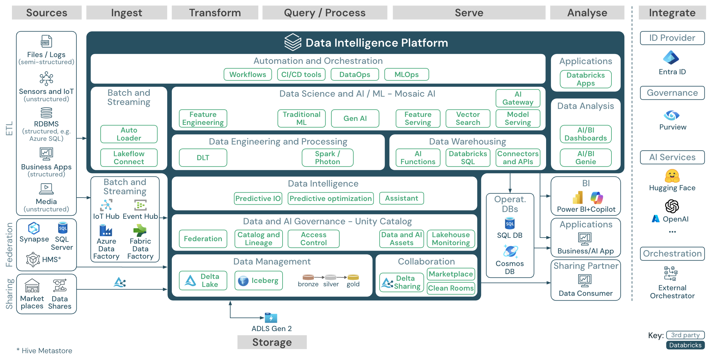
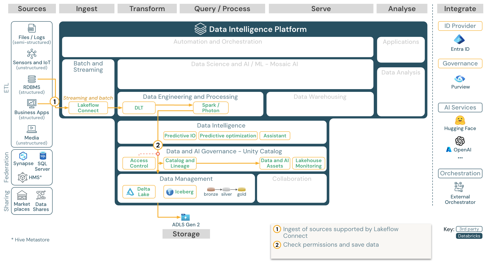
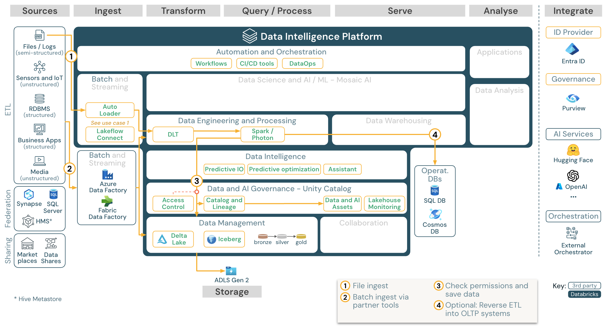
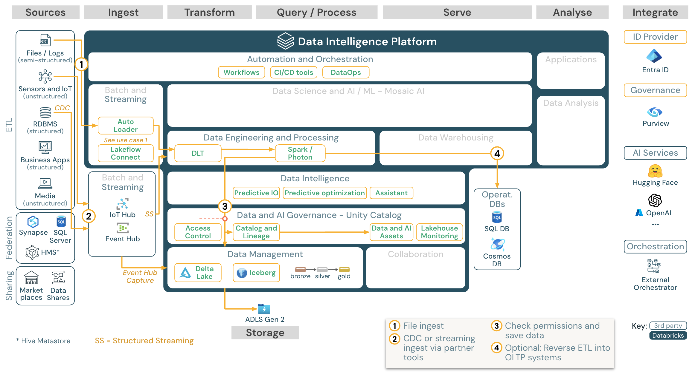
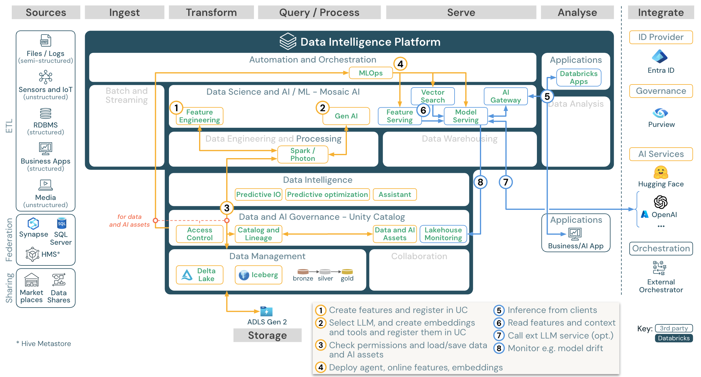
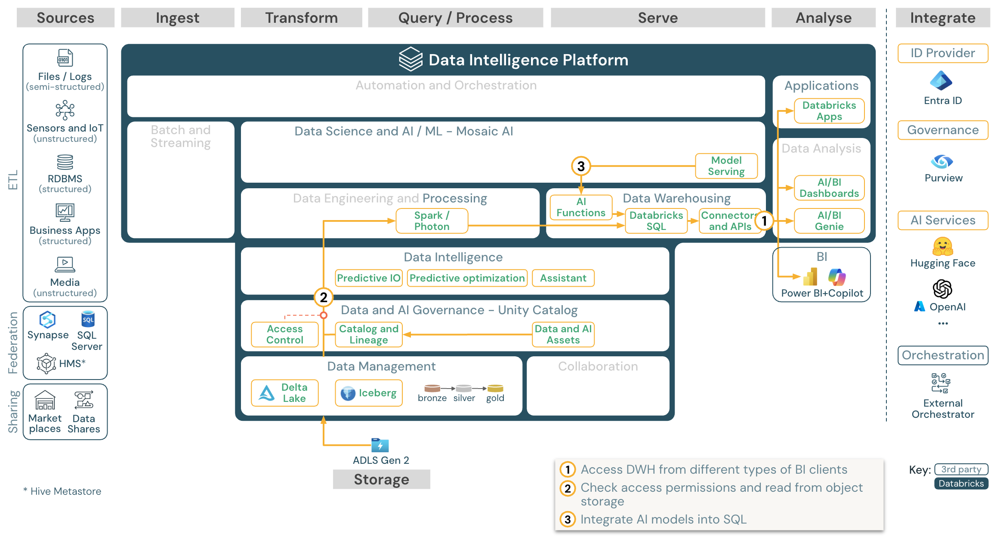
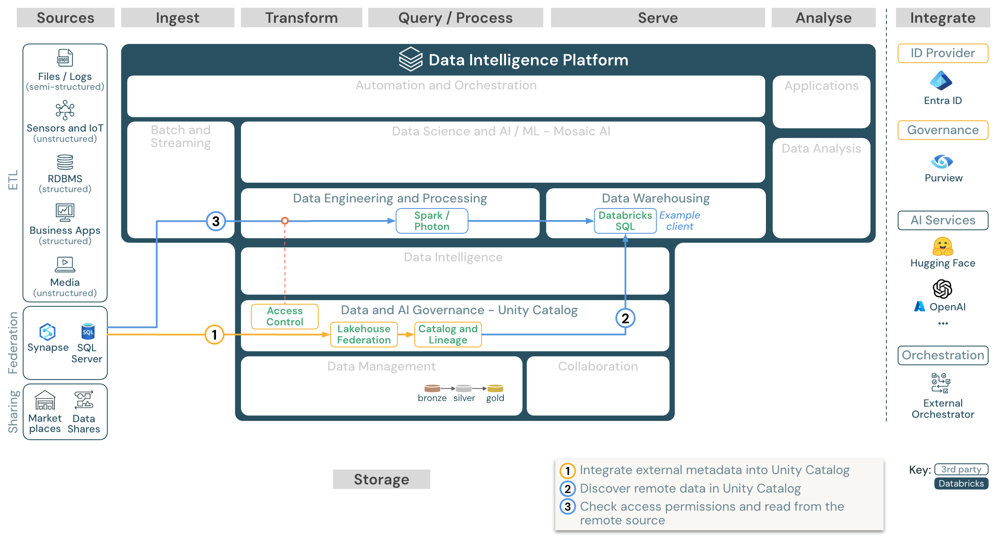
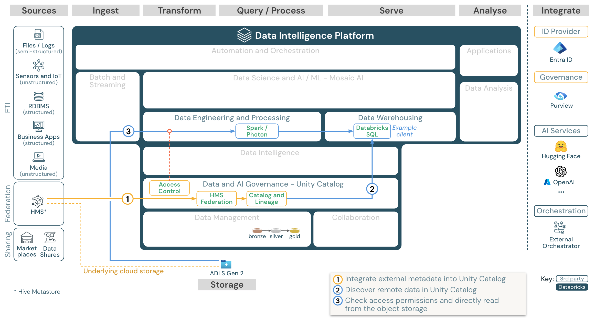
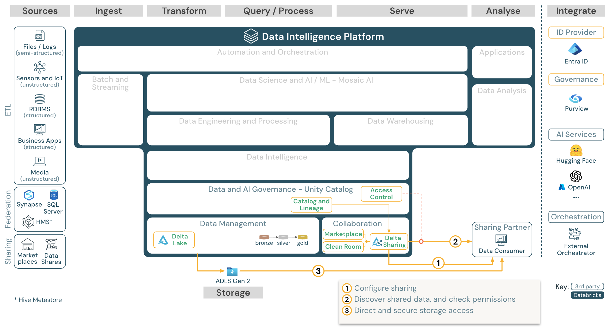
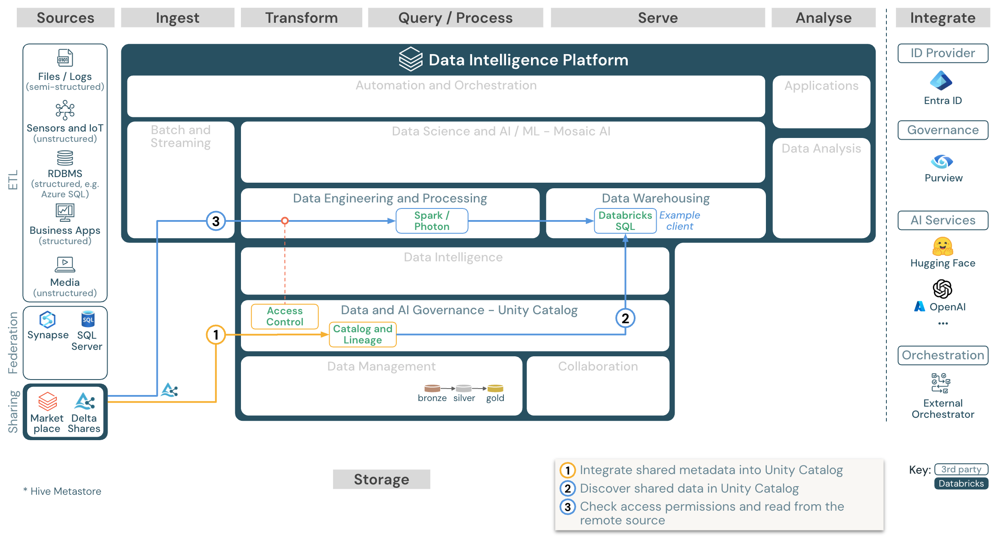

# Medallion_Architecture_Design_DocumentV2

*Document Type: DOCX*

## Table of Contents

  - [**In this article**](#in-this-article)
    - [[**Download: Reference architecture for the Azure Databricks ****lakehouse**](https://learn.microsoft.com/en-us/azure/databricks/_extras/documents/reference-architecture-databricks-on-azure.pdf)](#download-reference-architecture-for-the-azure-databricks-lakehousehttpslearnmicrosoftcomen-usazuredatabricks_extrasdocumentsreference-architecture-databricks-on-azurepdf)
  - [**Organization of ****the reference**** architectures**](#organization-of-the-reference-architectures)
  - [**Source**](#source)
  - [**Ingest**](#ingest)
  - [**Storage**](#storage)
  - [**Serving**](#serving)
  - [**Analysis**](#analysis)
  - [**Integrate**](#integrate)
  - [**Common capabilities for all workloads**](#common-capabilities-for-all-workloads)
  - [**Data and AI governance**](#data-and-ai-governance)
  - [**Data intelligence engine**](#data-intelligence-engine)
  - [**Automation & Orchestration**](#automation--orchestration)
    - [**High-level use cases for the Data Intelligence Platform on Azure**](#high-level-use-cases-for-the-data-intelligence-platform-on-azure)
    - [**Built-in ingestion from SaaS apps and databases with ****Lakeflow**** Connect**](#built-in-ingestion-from-saas-apps-and-databases-with-lakeflow-connect)
    - [[**Download: ****Lakeflow**** Connect reference architecture for Azure Databricks.**](https://learn.microsoft.com/en-us/azure/databricks/_extras/documents/reference-use-case-lakeflow-for-azure.pdf)](#download-lakeflow-connect-reference-architecture-for-azure-databrickshttpslearnmicrosoftcomen-usazuredatabricks_extrasdocumentsreference-use-case-lakeflow-for-azurepdf)
  - [**Batch ingestion and ETL**](#batch-ingestion-and-etl)
    - [[**Download: Batch ETL reference architecture for Azure Databricks**](https://learn.microsoft.com/en-us/azure/databricks/_extras/documents/reference-use-case-batch-for-azure.pdf)](#download-batch-etl-reference-architecture-for-azure-databrickshttpslearnmicrosoftcomen-usazuredatabricks_extrasdocumentsreference-use-case-batch-for-azurepdf)
  - [**Streaming and ****change**** data capture (CDC)**](#streaming-and-change-data-capture-cdc)
    - [[**Download: Spark structured streaming architecture for Azure Databricks**](https://learn.microsoft.com/en-us/azure/databricks/_extras/documents/reference-use-case-streaming-cdc-for-azure.pdf)](#download-spark-structured-streaming-architecture-for-azure-databrickshttpslearnmicrosoftcomen-usazuredatabricks_extrasdocumentsreference-use-case-streaming-cdc-for-azurepdf)
  - [**Machine learning and AI (traditional)**](#machine-learning-and-ai-traditional)
    - [[**Download: Machine learning and AI reference architecture for Azure Databricks**](https://learn.microsoft.com/en-us/azure/databricks/_extras/documents/reference-use-case-ai-for-azure.pdf)](#download-machine-learning-and-ai-reference-architecture-for-azure-databrickshttpslearnmicrosoftcomen-usazuredatabricks_extrasdocumentsreference-use-case-ai-for-azurepdf)
  - [**AI Agent applications (Gen AI)**](#ai-agent-applications-gen-ai)
    - [[**Download: Gen AI application reference architecture for Azure Databricks**](https://learn.microsoft.com/en-us/azure/databricks/_extras/documents/reference-use-case-gen-ai-agent-for-azure.pdf)](#download-gen-ai-application-reference-architecture-for-azure-databrickshttpslearnmicrosoftcomen-usazuredatabricks_extrasdocumentsreference-use-case-gen-ai-agent-for-azurepdf)
  - [**BI and SQL analytics**](#bi-and-sql-analytics)
    - [[**Download: BI and SQL analytics reference architecture for Azure Databricks**](https://learn.microsoft.com/en-us/azure/databricks/_extras/documents/reference-use-case-bi-for-azure.pdf)](#download-bi-and-sql-analytics-reference-architecture-for-azure-databrickshttpslearnmicrosoftcomen-usazuredatabricks_extrasdocumentsreference-use-case-bi-for-azurepdf)
  - [**Lakehouse federation**](#lakehouse-federation)
    - [[**Download: Lakehouse federation reference architecture for Azure Databricks**](https://learn.microsoft.com/en-us/azure/databricks/_extras/documents/reference-use-case-lh-federation-for-azure.pdf)](#download-lakehouse-federation-reference-architecture-for-azure-databrickshttpslearnmicrosoftcomen-usazuredatabricks_extrasdocumentsreference-use-case-lh-federation-for-azurepdf)
  - [**Catalog federation**](#catalog-federation)
    - [[**Download: Catalog federation reference architecture for Azure Databricks**](https://learn.microsoft.com/en-us/azure/databricks/_extras/documents/reference-use-case-cat-federation-for-azure.pdf)](#download-catalog-federation-reference-architecture-for-azure-databrickshttpslearnmicrosoftcomen-usazuredatabricks_extrasdocumentsreference-use-case-cat-federation-for-azurepdf)
  - [**Share Data with 3rd party tools**](#share-data-with-3rd-party-tools)
    - [[**Download: Share data with 3rd-party tools reference architecture for Azure Databricks**](https://learn.microsoft.com/en-us/azure/databricks/_extras/documents/reference-use-case-3p-sharing-for-azure.pdf)](#download-share-data-with-3rd-party-tools-reference-architecture-for-azure-databrickshttpslearnmicrosoftcomen-usazuredatabricks_extrasdocumentsreference-use-case-3p-sharing-for-azurepdf)
  - [**Consume shared data from Databricks**](#consume-shared-data-from-databricks)
    - [[**Download: Consume shared data from Databricks reference architecture for Azure Databricks**](https://learn.microsoft.com/en-us/azure/databricks/_extras/documents/reference-use-case-d2d-sharing-for-azure.pdf)](#download-consume-shared-data-from-databricks-reference-architecture-for-azure-databrickshttpslearnmicrosoftcomen-usazuredatabricks_extrasdocumentsreference-use-case-d2d-sharing-for-azurepdf)

Lakehouse reference architectures (download)

04/18/2025
## **In this article**

[Organization of the reference architectures](https://learn.microsoft.com/en-us/azure/databricks/lakehouse-architecture/reference)
[Common capabilities for all workloads](https://learn.microsoft.com/en-us/azure/databricks/lakehouse-architecture/reference)
[High-level use cases for the Data Intelligence Platform on Azure](https://learn.microsoft.com/en-us/azure/databricks/lakehouse-architecture/reference)
This article covers architectural guidance for the lakehouse in terms of data source, ingestion, transformation, querying and processing, serving, analysis, and storage.

Each reference architecture has a downloadable PDF in 11 x 17 (A3) format.

While the lakehouse on Databricks is an open platform that integrates with a [large ecosystem of partner tools](https://learn.microsoft.com/en-us/azure/databricks/integrations/), the reference architectures focus only on Azure services and the Databricks lakehouse. The cloud provider services shown are selected to illustrate the concepts and are not exhaustive.

### [**Download: Reference architecture for the Azure Databricks ****lakehouse**](https://learn.microsoft.com/en-us/azure/databricks/_extras/documents/reference-architecture-databricks-on-azure.pdf)

The Azure reference architecture shows the following Azure-specific services for ingesting, storage, serving, and analysis:

Azure Synapse and SQL Server as source systems for Lakehouse Federation
Azure IoT Hub and Azure Event Hubs for streaming ingest
Azure Data Factory for batch ingest
Azure Data Lake Storage Gen 2 (ADLS) as the object storage for data and AI assets
Azure SQL DB and Azure Cosmos DB as operational databases
Azure Purview as the enterprise catalog to which UC exports schema and lineage information
Power BI as the BI tool
Azure OpenAI can be used by Model Serving as an external LLM
## **Organization of ****the reference**** architectures**

The reference architecture is structured along the swim lanes *Source*, *Ingest*, *Transform*, *Query/Process*, *Serve*, *Analysis*, and *Storage*:

## **Source**

There are three ways to integrate external data into the Data Intelligence Platform:

[ETL](https://learn.microsoft.com/en-us/azure/databricks/getting-started/etl-quick-start): The platform enables integration with systems that provide semi-structured and unstructured data (such as sensors, IoT devices, media, files, and logs), as well as structured data from relational databases or business applications.
[Lakehouse Federation](https://learn.microsoft.com/en-us/azure/databricks/query-federation/): SQL sources, such as relational databases, can be integrated into the lakehouse and [Unity Catalog](https://learn.microsoft.com/en-us/azure/databricks/data-governance/unity-catalog/) without ETL. In this case, the source system data is governed by Unity Catalog, and queries are pushed down to the source system.
Catalog Federation: Hive Metastore catalogs can also be integrated into Unity Catalog through [catalog federation](https://learn.microsoft.com/en-us/azure/databricks/data-governance/unity-catalog/hms-federation/), allowing Unity Catalog to control the tables stored in Hive Metastore.
## **Ingest**

Ingest data into the lakehouse via batch or streaming:

[Databricks Lakeflow Connect](https://learn.microsoft.com/en-us/azure/databricks/ingestion/lakeflow-connect/) offers built-in connectors for ingestion from enterprise applications and databases. The resulting ingestion pipeline is governed by Unity Catalog and is powered by serverless compute and DLT.
Files delivered to cloud storage can be loaded directly using the Databricks [Auto Loader](https://learn.microsoft.com/en-us/azure/databricks/ingestion/cloud-object-storage/auto-loader/).
For batch ingestion of data from enterprise applications into [Delta Lake](https://learn.microsoft.com/en-us/azure/databricks/delta/), the [Databricks lakehouse](https://learn.microsoft.com/en-us/azure/databricks/lakehouse/) relies on [partner ingest tools](https://learn.microsoft.com/en-us/azure/databricks/partner-connect/ingestion) with specific adapters for these systems of record.
Streaming events can be ingested directly from event streaming systems such as Kafka using Databricks [Structured Streaming](https://learn.microsoft.com/en-us/azure/databricks/structured-streaming/concepts). Streaming sources can be sensors, IoT, or [change data capture](https://learn.microsoft.com/en-us/azure/databricks/dlt/cdc) processes.
## **Storage**

Data is typically stored in the cloud storage system where the ETL pipelines use the [medallion architecture](https://learn.microsoft.com/en-us/azure/databricks/lakehouse/medallion) to store data in a curated way as [Delta files/tables](https://learn.microsoft.com/en-us/azure/databricks/delta/) or [Iceberg tables](https://learn.microsoft.com/en-us/azure/databricks/delta/uniform).
**Transform** and **Query**** / process**
The Databricks lakehouse uses its engines [Apache Spark](https://learn.microsoft.com/en-us/azure/databricks/spark/) and [Photon](https://learn.microsoft.com/en-us/azure/databricks/compute/photon) for all transformations and queries.
[DLT](https://learn.microsoft.com/en-us/azure/databricks/dlt/) is a declarative framework for simplifying and optimizing reliable, maintainable, and testable data processing pipelines.
Powered by Apache Spark and Photon, the Databricks Data Intelligence Platform supports both types of workloads: SQL queries via [SQL warehouses](https://learn.microsoft.com/en-us/azure/databricks/compute/sql-warehouse/), and SQL, Python and Scala workloads via workspace [clusters](https://learn.microsoft.com/en-us/azure/databricks/compute/).
For data science (ML Modeling and [Gen AI](https://learn.microsoft.com/en-us/azure/databricks/machine-learning/)), the Databricks [AI and Machine Learning platform](https://learn.microsoft.com/en-us/azure/databricks/machine-learning/) provides specialized ML runtimes for AutoML and for coding ML jobs. All data science and MLOps workflows are best supported by MLflow.
## **Serving**

For data warehousing (DWH) and BI use cases, the Databricks lakehouse provides [Databricks SQL](https://learn.microsoft.com/en-us/azure/databricks/sql/), the data warehouse powered by [SQL warehouses](https://learn.microsoft.com/en-us/azure/databricks/compute/sql-warehouse/create), and [serverless SQL warehouses](https://learn.microsoft.com/en-us/azure/databricks/admin/sql/serverless).

For machine learning, [Mosaic AI Model Serving](https://learn.microsoft.com/en-us/azure/databricks/machine-learning/model-serving/) is a scalable, real-time, enterprise-grade model serving capability hosted in the Databricks control plane. [Mosaic AI Gateway](https://learn.microsoft.com/en-us/azure/databricks/ai-gateway/) is Databricks solution for governing and monitoring access to supported generative AI models and their associated model serving endpoints.
Operational databases: [External systems](https://learn.microsoft.com/en-us/azure/databricks/query-federation/), such as operational databases, can be used to store and deliver final data products to user applications.
Collaboration: Business partners get secure access to the data they need through [Delta Sharing](https://learn.microsoft.com/en-us/azure/databricks/delta-sharing/). Based on Delta Sharing, the [Databricks Marketplace](https://learn.microsoft.com/en-us/azure/databricks/marketplace/) is an open forum for exchanging data products.
[Clean Rooms](https://learn.microsoft.com/en-us/azure/databricks/clean-rooms/) are secure and privacy-protecting environments where multiple users can work together on sensitive enterprise data without direct access to each other's data.
## **Analysis**

The final business applications are in this swim lane. Examples include custom clients such as AI applications connected to [Mosaic AI Model Serving](https://learn.microsoft.com/en-us/azure/databricks/machine-learning/model-serving/) for real-time inference or applications that access data pushed from the lakehouse to an operational database.
For BI use cases, analysts typically use [BI tools to access the data warehouse](https://learn.microsoft.com/en-us/azure/databricks/partner-connect/bi). SQL developers can additionally use the [Databricks SQL Editor](https://learn.microsoft.com/en-us/azure/databricks/sql/user/sql-editor/) (not shown in the diagram) for queries and dashboarding.
The Data Intelligence Platform also offers [dashboards](https://learn.microsoft.com/en-us/azure/databricks/dashboards/) to build data visualizations and share insights.
## **Integrate**

The Databricks platform integrates with standard identity providers for [user management](https://learn.microsoft.com/en-us/azure/databricks/admin/users-groups/) and [single sign on (SSO)](https://learn.microsoft.com/en-us/azure/databricks/security/auth/).
External AI services like [OpenAI](https://learn.microsoft.com/en-us/azure/databricks/generative-ai/tutorials/external-models-tutorial), LangChain or HuggingFace can be used directly from within the Databricks Intelligence Platform.
External orchestrators can either use the comprehensive [REST API](https://learn.microsoft.com/en-us/azure/databricks/lakehouse-architecture/reference) or dedicated connectors to external orchestration tools like [Apache Airflow](https://airflow.apache.org/docs/apache-airflow-providers-databricks/stable/connections/databricks.html).
Unity Catalog is used for all data & AI governance in the Databricks Intelligence Platform and can integrate other databases into its governance through [Lakehouse Federation](https://learn.microsoft.com/en-us/azure/databricks/query-federation/).
Additionally, Unity Catalog can be integrated into other enterprise catalogs, e.g. [Purview](https://learn.microsoft.com/en-us/purview/register-scan-azure-databricks-unity-catalog). Contact the enterprise catalog vendor for details.

## **Common capabilities for all workloads**

In addition, the Databricks lakehouse comes with management capabilities that support all workloads:

## **Data and AI governance**

The central data and AI governance system in the Databricks Data Intelligence Platform is [Unity Catalog](https://learn.microsoft.com/en-us/azure/databricks/data-governance/unity-catalog/). Unity Catalog provides a single place to manage data access policies that apply across all workspaces and supports all assets created or used in the lakehouse, such as tables, volumes, features ([feature store](https://learn.microsoft.com/en-us/azure/databricks/machine-learning/feature-store/)), and models ([model registry](https://learn.microsoft.com/en-us/azure/databricks/machine-learning/manage-model-lifecycle/)). Unity Catalog can also be used to [capture runtime data lineage](https://learn.microsoft.com/en-us/azure/databricks/data-governance/unity-catalog/data-lineage) across queries run on Databricks.

Databricks lakehouse monitoring allows you to monitor the data quality of all of the tables in your account. It can also track the performance of [machine learning models and model-serving endpoints](https://learn.microsoft.com/en-us/azure/databricks/machine-learning/model-serving/monitor-diagnose-endpoints).

For observability, [system tables](https://learn.microsoft.com/en-us/azure/databricks/admin/system-tables/) is a Databricks-hosted analytical store of your account's operational data. System tables can be used for historical observability across your account.

## **Data intelligence engine**

The Databricks Data Intelligence Platform allows your entire organization to use data and AI, combining generative AI with the unification benefits of a lakehouse to understand the unique semantics of your data. See [Databricks AI-powered features](https://learn.microsoft.com/en-us/azure/databricks/databricks-ai/).

The [Databricks Assistant](https://learn.microsoft.com/en-us/azure/databricks/notebooks/databricks-assistant-faq) is available in Databricks notebooks, SQL editor, file editor, and elsewhere as a context-aware AI assistant for users.

## **Automation & Orchestration**

[Databricks Jobs](https://learn.microsoft.com/en-us/azure/databricks/jobs/) orchestrate data processing, machine learning, and analytics pipelines on the Databricks Data Intelligence Platform. [DLT](https://learn.microsoft.com/en-us/azure/databricks/dlt/) allow you to build reliable and maintainable ETL pipelines with declarative syntax. The platform also supports [CI/CD](https://learn.microsoft.com/en-us/azure/databricks/dev-tools/ci-cd/) and MLOps

### **High-level use cases for the Data Intelligence Platform on Azure**

### **Built-in ingestion from SaaS apps and databases with ****Lakeflow**** Connect**

### [**Download: ****Lakeflow**** Connect reference architecture for Azure Databricks.**](https://learn.microsoft.com/en-us/azure/databricks/_extras/documents/reference-use-case-lakeflow-for-azure.pdf)

Databricks Lakeflow Connect offers built-in connectors for ingestion from enterprise applications and databases. The resulting ingestion pipeline is governed by Unity Catalog and is powered by serverless compute and DLT. Lakeflow Connect leverages efficient incremental reads and writes to make data ingestion faster, scalable, and more cost-efficient, while your data remains fresh for downstream consumption.

## **Batch ingestion and ETL**

### [**Download: Batch ETL reference architecture for Azure Databricks**](https://learn.microsoft.com/en-us/azure/databricks/_extras/documents/reference-use-case-batch-for-azure.pdf)

Ingestion tools use source-specific adapters to read data from the source and then either store it in the cloud storage from where Auto Loader can read it, or call Databricks directly (for example, with partner ingestion tools integrated into the Databricks lakehouse). To load the data, the Databricks ETL and processing engine runs the queries via [DLT](https://learn.microsoft.com/en-us/azure/databricks/dlt/). Single or multitask workflows can be orchestrated by [Databricks Jobs](https://learn.microsoft.com/en-us/azure/databricks/jobs/) and governed by Unity Catalog (access control, audit, lineage, and so on). To provide access to specific golden tables for low-latency operational systems, export the tables to an operational database such as an RDBMS or key-value store at the end of the ETL pipeline.

## **Streaming and ****change**** data capture (CDC)**

### [**Download: Spark structured streaming architecture for Azure Databricks**](https://learn.microsoft.com/en-us/azure/databricks/_extras/documents/reference-use-case-streaming-cdc-for-azure.pdf)

The Databricks ETL engine uses [Spark Structured Streaming](https://learn.microsoft.com/en-us/azure/databricks/structured-streaming/concepts) to read from event queues such as Apache Kafka or Azure Event Hub. The downstream steps follow the approach of the Batch use case above.

Real-time [change data capture](https://learn.microsoft.com/en-us/azure/databricks/dlt/what-is-change-data-capture) (CDC) typically uses an event queue to store the extracted events. From there, the use case follows the streaming use case.

If CDC is done in batch where the extracted records are stored in cloud storage first, then Databricks Autoloader can read them and the use case follows Batch ETL.

## **Machine learning and AI (traditional)**

### [**Download: Machine learning and AI reference architecture for Azure Databricks**](https://learn.microsoft.com/en-us/azure/databricks/_extras/documents/reference-use-case-ai-for-azure.pdf)

For machine learning, the Databricks Data Intelligence Platform provides Mosaic AI, which comes with state-of-the-art [machine and deep learning libraries](https://learn.microsoft.com/en-us/azure/databricks/machine-learning/databricks-runtime-ml). It provides capabilities such as [Feature Store](https://learn.microsoft.com/en-us/azure/databricks/machine-learning/feature-store/) and [Model Registry](https://learn.microsoft.com/en-us/azure/databricks/machine-learning/manage-model-lifecycle/) (both integrated into Unity Catalog), low-code features with AutoML, and MLflow integration into the data science lifecycle.

All data science-related assets (tables, features, and models) are governed by Unity Catalog and data scientists can use [Databricks Jobs](https://learn.microsoft.com/en-us/azure/databricks/jobs/) to orchestrate their jobs.

For deploying models in a scalable and enterprise-grade way, use the MLOps capabilities to publish the models in model serving.

## **AI Agent applications (Gen AI)**

### [**Download: Gen AI application reference architecture for Azure Databricks**](https://learn.microsoft.com/en-us/azure/databricks/_extras/documents/reference-use-case-gen-ai-agent-for-azure.pdf)

For generative AI use cases, Mosaic AI comes with state-of-the-art libraries and specific [Gen AI capabilities](https://learn.microsoft.com/en-us/azure/databricks/machine-learning/) from prompt engineering to building AI Agents and fine-tuning of existing models. The above architecture shows an example of how to integrate [Vector Search](https://learn.microsoft.com/en-us/azure/databricks/generative-ai/vector-search) into a Gen AI agent.

For deploying models in a scalable and enterprise-grade way, use the MLOps capabilities to publish the models in model serving.

## **BI and SQL analytics**

### [**Download: BI and SQL analytics reference architecture for Azure Databricks**](https://learn.microsoft.com/en-us/azure/databricks/_extras/documents/reference-use-case-bi-for-azure.pdf)

For BI use cases, business analysts can use [dashboards](https://learn.microsoft.com/en-us/azure/databricks/dashboards/), the [Databricks SQL editor](https://learn.microsoft.com/en-us/azure/databricks/sql/user/sql-editor/) or [BI tools](https://learn.microsoft.com/en-us/azure/databricks/data-governance/unity-catalog/business-intelligence) such as Tableau or Power BI. In all cases, the engine is Databricks SQL (serverless or non-serverless), and Unity Catalog provides data discovery, exploration, and access control.

## **Lakehouse federation**

### [**Download: Lakehouse federation reference architecture for Azure Databricks**](https://learn.microsoft.com/en-us/azure/databricks/_extras/documents/reference-use-case-lh-federation-for-azure.pdf)

[Lakehouse Federation](https://learn.microsoft.com/en-us/azure/databricks/query-federation/) allows external data SQL databases (such as MySQL, Postgres, SQL Server, or Azure Synapse) to be integrated with Databricks.

All workloads (AI, DWH, and BI) can benefit from this without the need to ETL the data into object storage first. The external source catalog is mapped into the Unity catalog and fine-grained access control can be applied to access via the Databricks platform.

## **Catalog federation**

### [**Download: Catalog federation reference architecture for Azure Databricks**](https://learn.microsoft.com/en-us/azure/databricks/_extras/documents/reference-use-case-cat-federation-for-azure.pdf)

[Catalog federation](https://learn.microsoft.com/en-us/azure/databricks/data-governance/unity-catalog/hms-federation/) allows external Hive Metastores (such as MySQL, Postgres, SQL Server, or Azure Synapse) to be integrated with Databricks.

All workloads (AI, DWH, and BI) can benefit from this without the need to ETL the data into object storage first. The external source catalog is added to Unity Catalog where fine-grained access control is applied via the Databricks platform.

## **Share Data with 3rd party tools**

### [**Download: Share data with 3rd-party tools reference architecture for Azure Databricks**](https://learn.microsoft.com/en-us/azure/databricks/_extras/documents/reference-use-case-3p-sharing-for-azure.pdf)

Enterprise-grade data sharing with 3rd parties is provided by [Delta Sharing](https://learn.microsoft.com/en-us/azure/databricks/delta-sharing/). It enables direct access to data in the object store secured by Unity Catalog. This capability is also used in the [Databricks Marketplace](https://learn.microsoft.com/en-us/azure/databricks/marketplace/), an open forum for exchanging data products.

## **Consume shared data from Databricks**

### [**Download: Consume shared data from Databricks reference architecture for Azure Databricks**](https://learn.microsoft.com/en-us/azure/databricks/_extras/documents/reference-use-case-d2d-sharing-for-azure.pdf)

The [Delta Sharing Databricks-to-Databricks protocol](https://learn.microsoft.com/en-us/azure/databricks/delta-sharing/share-data-databricks) allows to share data securely with any Databricks user, regardless of account or cloud host, as long as that user has access to a workspace enabled for Unity Catalog.

